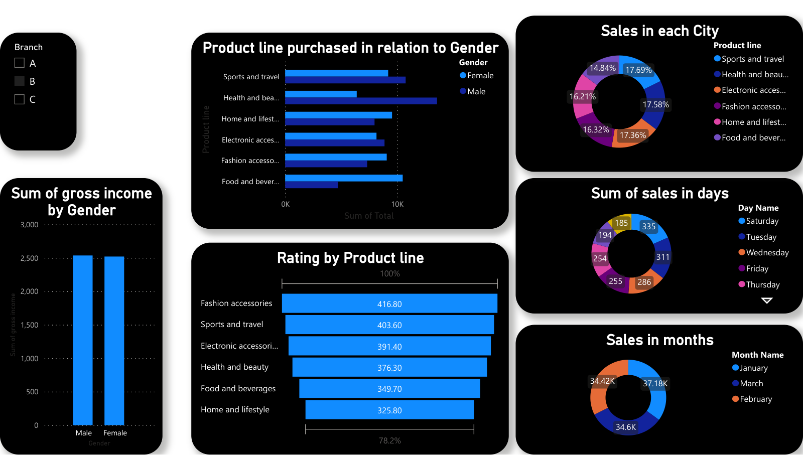

# Supermarket Sales Dashboard (Power BI)

An interactive Power BI dashboard on supermarket transactions across three branches (A, B, C) for January–March.

## What it answers
- **Who buys what:** product-line spend split by customer gender
- **Where sales come from:** each product line's share of sales by city
- **When people shop:** sales by weekday and by month
- **Customer satisfaction:** ratings by product line
- **Revenue:** gross income by gender

The **Branch** slicer filters every visual, so a manager can compare one store against the others.

**Tools:** Power BI Desktop (Power Query for cleaning, DAX measures, slicers)
**File:** [`Super Market Sales.pdf`](Super%20Market%20Sales.pdf) (exported report)
